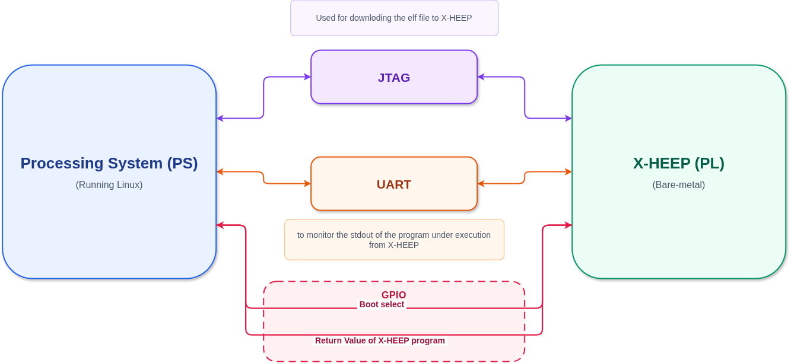

# FPGA VPK180: Getting Started

This page introduces the Versal Premium device and provides step-by-step instructions for setting up, debugging, and programming the VPK180 FPGA board. It assumes that you have already generated the Programmable Device Images (PDIs) and installed the necessary tools. Please refer to the following guide before proceeding:

* [Bitstream Generation Guide](./RunOnFPGA.md)

---

## Design Flow

The VPK180 target currently supports only a design flow with Processing System (PS) connections. As with Processing System-enabled designs on other FPGA targets, X-HEEP is connected to the **Processing System (PS)** via JTAG, UART, and some GPIO pins.



Figure 1 shows the connections between X-HEEP and the PS. This implementation enables the APU to program applications on X-HEEP. Using JTAG, the APU can program the ELF file into the embedded memory banks for the text section, select the boot mode, and retrieve the application's return value using **GPIOs**. It can also optionally monitor the standard output (`stdout`) of the code being executed via UART.

## Hardware Connection Steps /// TODO ///


1. **Power Up the Board**

   - Connect the power supply as shown in the schematic **(1)**.

   - Turn on the board using the power switch **(2)**.

2. **Connect USB**

   - Use a USB cable **(3)** to connect your development machine to the board.

3. **Ensure Vivado Board Files Are Installed**

   - Vivado must be able to recognize the VPK180 board. Ensure the board files are placed in the following directory:

     ```
     <Vivado_Install_Dir>/data/boards/board_files
     ```

   - You can obtain the board files either from:

     - [Xilinx Official VPK180 Page](https://www.xilinx.com/products/boards-and-kits/vpk180.html)

     - [X-HEEP GitHub Repository](https://github.com/x-heep/x-heep)


4. **Ensure Appropriate Switch Settings**

   - To boot the system from the SD card with the appropriate System Controller settings, ensure that SW1 and SW11 on the board are set as shown in Figure 1 **(3)**.

```{note}
Unlike other platforms, VPK180 does not yet have a dedicated programmer. For now, X-HEEP can only be programmed using the on-chip programming flow with help from the APU. This flow depends on the Processing System. The `PS_ENABLE` parameter instantiates the PS and is enabled by default for VPK180; see [Build and program the FPGA using the Processing System](./RunOnFPGA.md#build-and-program-the-fpga-using-the-processing-system) for more information.
```

---


## Software Requirements /// TODO ///

To program the board, you need a stable Linux operating system running on the PS. Refer to the Linux packaging guide using PetaLinux for the VPK180 target <PROVIDE_THE_LINK!>.

A software package has been developed for the PS programming flow and can also be used with VPK180 targets. Refer to the repository here (**TODO: PROVIDE THE LINK**). You can use this SDK to program the system.


## Programming the Board

To program X-HEEP, follow these steps:

1. **Compile the App**

   Refer to the [Compile applications documentation](./../How_to/CompileApps.md).

   ```bash
   make app TARGET=vpk180 PROJECT=hello_world
   ```

2. **Program via JTAG**

   Copy the generated `.elf` file to the Linux system running on the PS. Then, run the `xheepRun_vpk180.py` script to program the device:

   ```bash
   sudo python3 src/xheepRun_vpk180.py \
       -f path/to/elf_file.elf \
       --jtag-addr 0xA4000000 \
       --gpio-addr 0xA4020000 \
       --uart 0xA4040000
   ```

   The script must be run with `sudo` privileges to access the JTAG, GPIO, and UART modules.

   ```{note}
   Compared to Zynq FPGA flows, the VPK180 platform does not support programming via SPI because the QuadSPI chip is unavailable. For now, it can only be programmed through JTAG.
   ```

   ```{warning}
   Make sure to provide the correct physical addresses of the UART, JTAG, and GPIO modules. Otherwise, the script will not work and, in some cases, may cause a kernel panic.
   ```

3. **Optional: Open a Serial Connection for Debugging** /// TODO : CHANGED TO DEVICE TREE METHOD AGAIN///

   To view `printf` output in the terminal, you can connect to the UART channel from the PS using the `uart_monitor.py` script. Run the following command:

   ```bash
   sudo python3 src/uart_monitor.py -t 100 -a 0xA4040000
   ```

   > [!NOTE]
   > Make sure to provide the correct physical address of the UART device.

---

## Notes

* Refer to the schematic diagram included in the repository for switch and connection references.

* Always make sure the PDI and Vivado configuration match your hardware revision.
